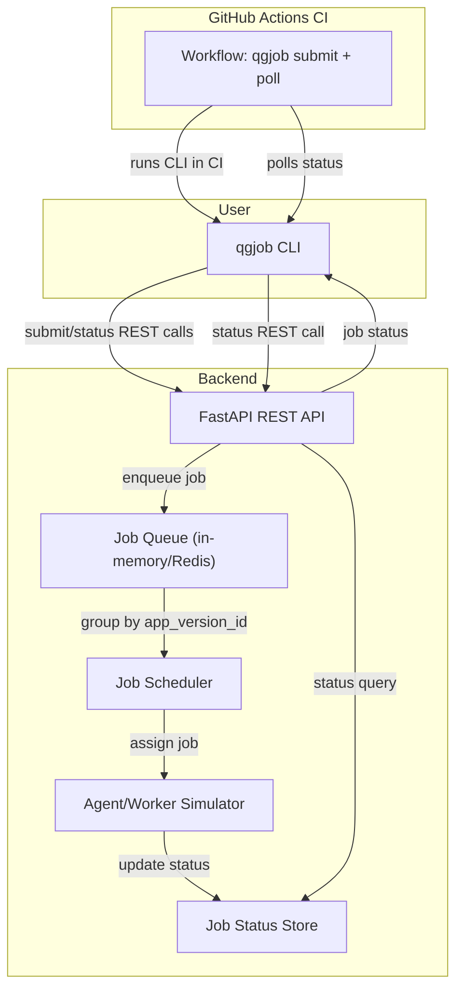

# QualGent Coding Challenge

## qgjob CLI Tool

### Installation

```sh
pip install .
```

### Usage


#### Submit a test job

```sh
python -m qgjob.cli submit --org-id=acme --app-version-id=xyz123 --test=tests/onboarding.spec.js --target=emulator
```

#### Check job status

```sh
python -m qgjob.cli status --job-id=<job_id>
```

#### Help

```sh
python -m qgjob.cli --help
```

---

(Backend server must be running at http://localhost:8000)

---


### Backend Setup

Nodejs should be installed from https://nodejs.org/en/download

#### Install

```sh
pip install -r requirements.txt
```
#### Run Server

```sh
python -c "import uvicorn; uvicorn.run('job_server.main:app', host='0.0.0.0', port=8000, reload=True)"
```


#### Grouping:

Jobs are grouped by App Version ID and Target. Jobs must have the same App Version ID and Target to be in the same group.

Example Test Set:

org_id:	    app_version_id	    test_path	            target	    Expected Group Key

qualgent	    xyz123	    tests/onboarding.spec.js	emulator	('xyz123', 'emulator')
qualgent	    xyz123	    tests/login.spec.js	        emulator	('xyz123', 'emulator')
qualgent	    xyz123	    tests/onboarding.spec.js	device	    ('xyz123', 'device')
qualgent	    xyz999	    tests/onboarding.spec.js	emulator	('xyz999', 'emulator')
acme	        xyz123	    tests/onboarding.spec.js	emulator	('xyz123', 'emulator')


What to Expect:
Jobs 1, 2, and 5 should be grouped together under ('xyz123', 'emulator').
Job 3 should be in its own group: ('xyz123', 'device').
Job 4 should be in its own group: ('xyz999', 'emulator').


Commands to Submit Jobs:
```sh
python -m qgjob.cli submit --org-id=qualgent --app-version-id=xyz123 --test=tests/onboarding.spec.js --target=emulator
python -m qgjob.cli submit --org-id=qualgent --app-version-id=xyz123 --test=tests/login.spec.js --target=emulator
python -m qgjob.cli submit --org-id=qualgent --app-version-id=xyz123 --test=tests/onboarding.spec.js --target=device
python -m qgjob.cli submit --org-id=qualgent --app-version-id=xyz999 --test=tests/onboarding.spec.js --target=emulator
python -m qgjob.cli submit --org-id=acme --app-version-id=xyz123 --test=tests/onboarding.spec.js --target=emulator
```

Checking the Grouping:
Visit http://localhost:8000/debug/groups in a browser and check "Pretty Print" to see the groups visually


#### Scheduling

After submitting a job use the job IDs returned to check their status:

```sh
python -m qgjob.cli status --job-id=<job_id>
```
Immediately after submission, status should be queued.
After a second or two, status should become running.
After a few more seconds, status should become completed.


## Architecture Diagram

