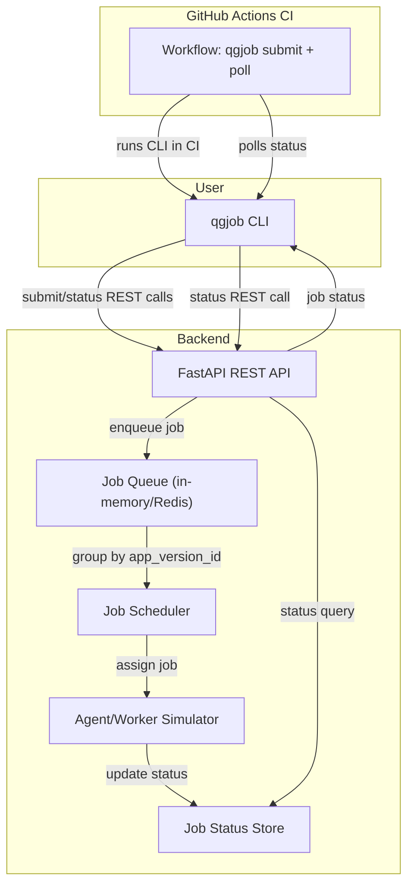

# QualGent Coding Challenge

## qgjob CLI Tool

### Installation

```sh
pip install -r requirements.txt
```
### Backend Setup

Nodejs should be installed from https://nodejs.org/en/download


### Usage


#### Start Server

```sh
python -c "import uvicorn; uvicorn.run('job_server.main:app', host='0.0.0.0', port=8000, reload=True)"
```


#### Submit a test job

```sh
python -m qgjob.cli submit --org-id=acme --app-version-id=xyz123 --test=tests/onboarding.spec.js --target=emulator
```

#### Check job status

```sh
python -m qgjob.cli status --job-id=<job_id>
```

#### Help

```sh
python -m qgjob.cli --help
```

---

(Backend server must be running at http://localhost:8000)

---

#### Grouping:

Jobs with the same app_version_id and target are grouped together

Jobs with different app_version_id create separate groups

Jobs with different target create separate groups

Jobs in the same group run together (sequentially)

The scheduler processes groups one at a time


Checking the Grouping:
Visit http://localhost:8000/debug/groups in a browser and check "Pretty Print" to see the groups visually


#### Scheduling

After submitting a job use the job IDs returned to check their status:

```sh
python -m qgjob.cli status --job-id=<job_id>
```
Immediately after submission, status should be queued.
After a second or two, status should become running.
After a few more seconds, status should become completed.

### Testing Grouping and Scheduling

```sh
python cli_grouping_test.py
```

When you run the tests, you should see:
Jobs with app_v1/emulator grouped together
Jobs with app_v2/emulator in a separate group
Jobs with app_v1/browserstack in another separate group
Groups being processed one at a time by the scheduler


## Architecture Diagram

